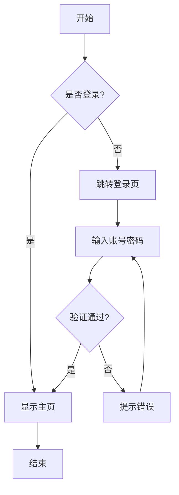
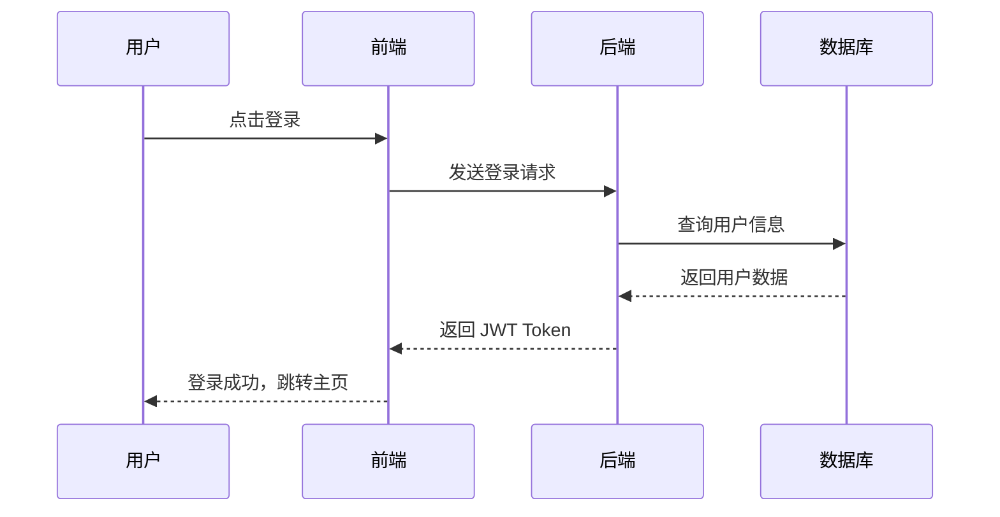
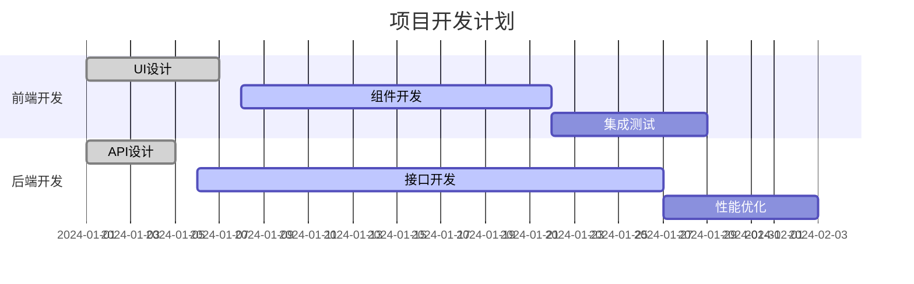

# Markdown 功能展示

本文展示了博客支持的所有 Markdown 功能。

## 1. 文本格式

这是一段普通文本。你可以使用 **粗体**、*斜体*、~~删除线~~、`行内代码` 等格式。

> 这是一个引用块。引用块可以包含多个段落。
>
> 引用块中也可以包含 **格式化文本**。

## 2. 列表

### 无序列表

- 第一项
- 第二项
  - 嵌套项 1
  - 嵌套项 2
- 第三项

### 有序列表

1. 第一步
2. 第二步
   1. 子步骤 A
   2. 子步骤 B
3. 第三步

## 3. 代码高亮

### JavaScript 代码

```javascript
// 斐波那契数列
function fibonacci(n) {
  if (n <= 1) return n;
  return fibonacci(n - 1) + fibonacci(n - 2);
}

// 使用动态规划优化
function fibonacciDP(n) {
  const dp = [0, 1];
  for (let i = 2; i <= n; i++) {
    dp[i] = dp[i - 1] + dp[i - 2];
  }
  return dp[n];
}

console.log(fibonacciDP(10)); // 55
```

### TypeScript 代码

```typescript
interface User {
  id: number;
  name: string;
  email: string;
  age?: number;
}

class UserService {
  private users: User[] = [];

  addUser(user: User): void {
    this.users.push(user);
  }

  getUser(id: number): User | undefined {
    return this.users.find(user => user.id === id);
  }

  getAllUsers(): User[] {
    return [...this.users];
  }
}

const userService = new UserService();
userService.addUser({ id: 1, name: "张三", email: "zhangsan@example.com" });
```

### Python 代码

```python
import numpy as np
import matplotlib.pyplot as plt

def plot_sine_wave():
    """绘制正弦波"""
    x = np.linspace(0, 2 * np.pi, 100)
    y = np.sin(x)
    
    plt.figure(figsize=(10, 6))
    plt.plot(x, y, 'b-', linewidth=2, label='sin(x)')
    plt.xlabel('x')
    plt.ylabel('y')
    plt.title('正弦函数图像')
    plt.grid(True, alpha=0.3)
    plt.legend()
    plt.show()

if __name__ == "__main__":
    plot_sine_wave()
```

## 4. 表格

| 语言 | 类型 | 年份 | 特点 |
|------|------|------|------|
| JavaScript | 动态类型 | 1995 | 原型继承、事件驱动 |
| TypeScript | 静态类型 | 2012 | JavaScript 超集、类型安全 |
| Python | 动态类型 | 1991 | 简洁优雅、丰富的库 |
| Rust | 静态类型 | 2010 | 内存安全、零成本抽象 |

## 5. 图片

### Obsidian 格式图片（从 content/assets 文件夹）

![[demo.jpg]]

### 本地图片（使用 Next.js Image 优化）


### 外部图片


## 6. Mermaid 流程图

### 流程图



### 时序图



### 甘特图



## 7. 数学公式（如果需要可以添加 KaTeX 支持）

行内公式：$E = mc^2$

块级公式：

$$
\frac{n!}{k!(n-k)!} = \binom{n}{k}
$$

## 8. 链接

- [外部链接 - GitHub](https://github.com)
- [内部链接 - 返回首页](/)
- [锚点链接 - 回到顶部](#markdown-功能展示)

## 9. 任务列表

- [x] 支持 Markdown 基础语法
- [x] 支持代码高亮
- [x] 支持图片展示
- [x] 支持 Mermaid 流程图
- [ ] 支持 KaTeX 数学公式（可选）
- [ ] 支持脚注（可选）

## 10. 分隔线

---

## 总结

以上就是博客支持的主要 Markdown 功能。这些功能可以帮助你创建内容丰富、格式美观的技术文章。

如果你有任何问题或建议，欢迎通过 [关于页面](/about) 联系我。